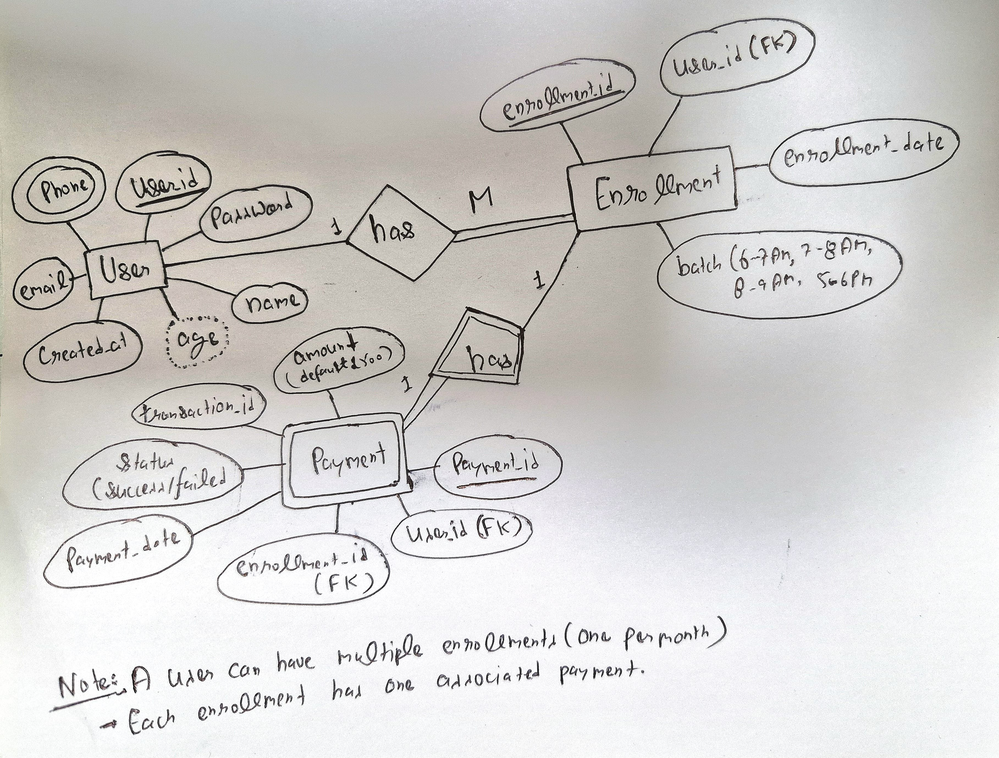

# Flexmoney Yoga Admission System

A full-stack application built as part of the Flexmoney Internship Assignment. This project allows users (aged 18–65) to enroll for monthly yoga classes by selecting from four available batches. The application includes user authentication (signup/login) and simulates monthly payment processing via a mock payment function. Once enrolled, users can view their enrollment details—including the monthly fee, plan expiry date, and a visual payment indicator—on their profile page.

## Table of Contents

- [Screenshots](#screenshots)
- [Features](#features)
- [Tech Stack](#tech-stack)
- [ER Diagram](#er-diagram)
- [Approach](#approach)
- [Installation & Setup](#installation--setup)
- [Deployment](#deployment)
- [Assumptions](#assumptions)


## Screenshots


## Features

- **User Authentication:**  
  - Sign up with validations (age must be between 18 and 65).  
  - Login and session management using JWT.

- **Monthly Enrollment:**  
  - Enroll in a monthly yoga class by selecting one of four batches (6-7AM, 7-8AM, 8-9AM, 5-6PM).  
  - Prevents duplicate enrollment within the same month.

- **Payment Processing (Simulated):**  
  - Simulates a monthly fee payment (INR 500) using a mock `CompletePayment()` function.  
  - Displays a green tick and green text on successful payment.

- **Profile Dashboard:**  
  - View personal details and enrollment information.  
  - Shows monthly fee, plan expiry (last day of the month), and payment status.

- **Modern UI:**  
  - Responsive, modern design using React and Tailwind CSS.
  - Custom branding for Flexmoney with logo and personalized headers.

## Tech Stack

- **Frontend:**  
  - React.js  
  - Tailwind CSS  
  - React Router v6

- **Backend:**  
  - Node.js  
  - Express.js  
  - MongoDB with Mongoose  
  - JWT for authentication  
  - bcrypt for password hashing


## ER Diagram

Below is the ER diagram representing the database design:



[User]
  - user_id (PK)
  - name
  - age
  - email
  - phone
  - password
  - createdAt

[Enrollment]
  - enrollment_id (PK)
  - user_id (FK to User)
  - batch (6-7AM, 7-8AM, 8-9AM, 5-6PM)
  - enrollmentDate

[Payment]
  - payment_id (PK)
  - user_id (FK to User)
  - enrollment_id (FK to Enrollment)
  - amount (default 500)
  - transactionId
  - status (success/failed)
  - paymentDate


## Approach
**Backend:**
Built using Node.js, Express, and MongoDB to manage user data, enrollments, and payments. Security is enhanced with JWT authentication and bcrypt for password hashing. The ER diagram reflects the relationships among Users, Enrollments, and Payments.

**Frontend:**
Developed with React and styled using Tailwind CSS for a responsive, modern UI. React Router v6 is used for navigation, and the design includes personalized elements for Flexmoney.

**Deployment:**
The backend is hosted on Render and the frontend on Vercel. Environment variables and API endpoints have been configured accordingly.

## Installation & Setup

 **Backend Setup**

1. **Clone the Repository:**

   ```bash
   git clone https://github.com/vineetvermaa61/Flexmoney_Assignment/server.git
   cd server

2. **Install Dependencies:**
   ```bash
   npm install

3. **Configure Environment Variables:**
Create a .env file in the root directory and add:
  ```bash
   PORT=5000
   MONGO_URI=your_mongodb_connection_string
   JWT_SECRET=yourSecretKeyHere

4. **Run the Server:**
   ```bash
   npm start

The server will start on http://localhost:5000.

**Frontend Setup**
Clone the Repository:
git clone https://github.com/vineetvermaa61/Flexmoney_Assignment.git
cd Flexmoney_Assignment

**Install Dependencies:**
npm install

**Configure Tailwind CSS:**
Ensure that tailwind.config.js and src/index.css are set up as described.

**Run the Application:**
npm start

The app will be available on http://localhost:3000.

## Deployment
**Backend:**
Deployed on Render.
URL: https://flexmoney-assignment-47gl.onrender.com

**Frontend:**
Deployed on Vercel.
URL: https://yoga-admission.vercel.app/


## Assumptions
- The monthly fee is fixed at INR 500.
- Users are eligible only if their age is between 18 and 65.
- Payment is simulated using a mock function (CompletePayment()), with no real payment integration.
- A user can enroll only once per month, but may change batches next month.
- Tailwind CSS is used for styling to give a modern, professional look.
- Personalized branding with the Flexmoney logo and headers is added to tailor the solution for Flexmoney.
